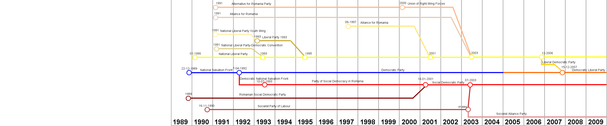
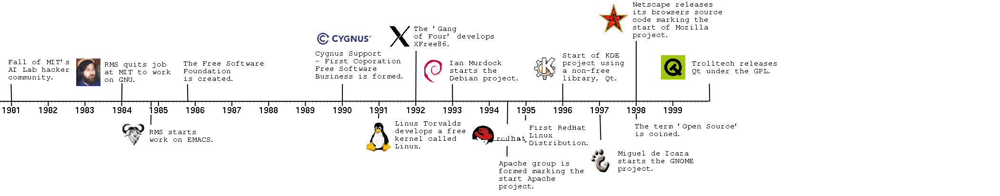

# ngx-syncscroll

[](https://www.npmjs.com/package/ngx-syncscroll) [](https://npmjs.org/package/ngx-syncscroll)  [](https://npmjs.org/package/ngx-syncscroll) [](https://angular.io)

ngx-syncscroll is a micro library rewritten in Angular, which allows to scroll two or more scrollable areas simultaneously.

Based on https://github.com/asvd/syncscroll.

This project was generated with [Angular CLI](https://github.com/angular/angular-cli).

## Development server

Run `ng serve` for a dev server. Navigate to `http://localhost:4200/`. The app will automatically reload if you change any of the source files.

### OR

Go to [sync-scroll](https://sezmars.github.io/syncscroll/).

## Code scaffolding

Run `ng generate component component-name` to generate a new component. You can also use `ng generate directive|pipe|service|class|guard|interface|enum|module`.

## Build

Run `ng build` to build the project. The build artifacts will be stored in the `dist/` directory. Use the `--prod` flag for a production build.

```HTML
<ngx-syncscroll [classSyncScroll]="'drag-timeline'" [dragState]="true" [attributeName]="'drag-scroll-timeline'">
       <div class="container syncscroll dragscroll frame time romanian" [ngClass]="'drag-timeline'"
            [attr.drag-scroll-timeline]="true">
         
       </div>
   
       <div class="container syncscroll dragscroll frame time floss" [ngClass]="'drag-timeline'"
            [attr.drag-scroll-timeline]="true">
         
       </div>
</ngx-syncscroll>
```

## Installation

```shell
npm install --save ngx-syncscroll
```

## Usage

Add `NgxSyncScrollModule` to your list of module imports:

```typescript
import { NgxSyncScrollModule } from 'ngx-syncscroll';

@NgModule({
  declarations: [AppComponent],
  imports: [BrowserModule, NgxSyncScrollModule],
  bootstrap: [AppComponent]
})
class AppModule {}
```

You can then use the component in your templates:

```typescript
@Component({
  selector: 'app',
  template: `
    <ngx-syncscroll [classSyncScroll]="'drag-timeline'" [dragState]="true" [attributeName]="'drag-scroll-timeline'">
       <div class="container syncscroll dragscroll frame time romanian" [ngClass]="'drag-timeline'"
            [attr.drag-scroll-timeline]="true">
         
       </div>
   
       <div class="container syncscroll dragscroll frame time floss" [ngClass]="'drag-timeline'"
            [attr.drag-scroll-timeline]="true">
         
       </div>
     </ngx-syncscroll>
       `
})
```

### Options

| Property name | Type | Default | Description |
| ------------- | ---- | ------- | ----------- |
| `dragState` | boolean | `false` | Drag mode for images. |
| `attributeName` | string | `null` | Unique attribute name for a block with scrolling. Need to be used with [attr] property for child. |
| `classSyncScroll` | string | `null` | Unique class name for a block with scrolling. Need to be used with [ngClass] or html class for child. |

